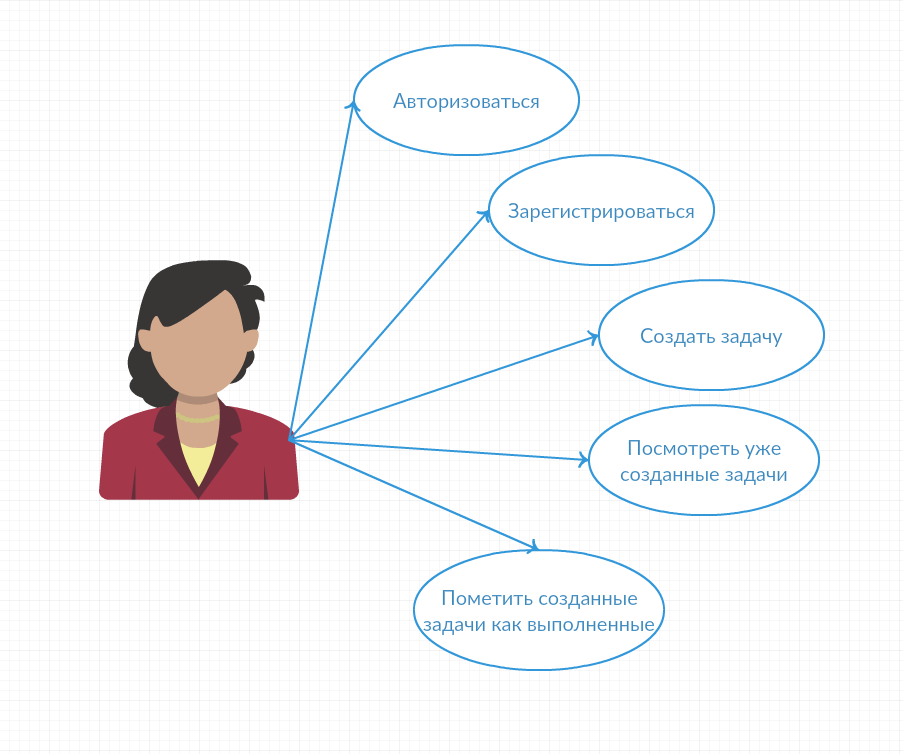
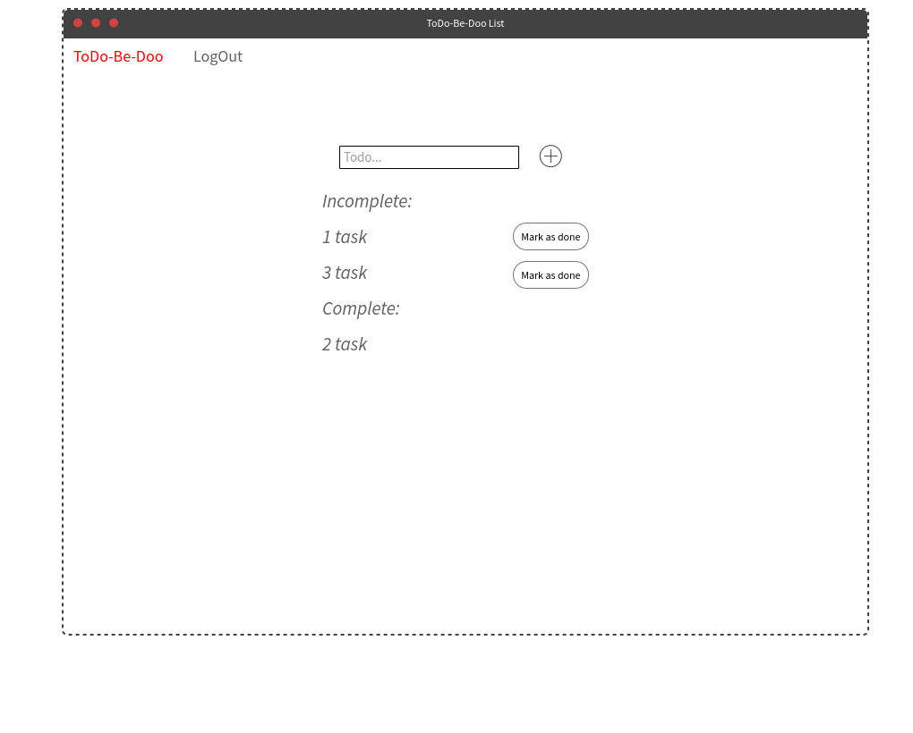

#### Название проекта
-  ToDo-Bee-Do

#### Какая проблема
    При ведении многих дел обновременно необходимо место 
    для хранения информации о выполненных и ожидающих выполнения заданиях.
    Для этого можно вести ежедневник, 
    а можно воспользоваться приложением, доступным из любого устройства в любое время.
#### Описание ролей пользователя

#### ER-диаграмма сущностей

#### Прототип интерфейса.

#### Архитектура приложения

#### Выбор Backend- и Frontend-стеков
- MPA приложение
###### Frontend

- Jinja2, WTF-Forms, html, css
###### Backend

- Flask + SQLAlchemy

###### DataBase

- SQLite
